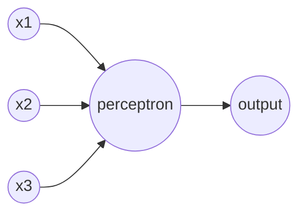
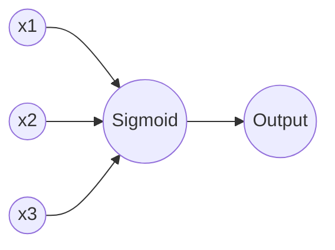

## Artificial Neuron

人工神经元有：

- Perceptrons（感知机）
- Sigmoid

### Perceptron

感知机**input是多个二进制**，**output是一个二进制**。

#### 感知机规则

$$
output=
\begin{cases}
0& \text{if } \sum_{j}w_{j}x_{j}\le \text{threshold}\\
1& \text{if } \sum_{j}w_{j}x_{j}\gt \text{threshold}
\end{cases}
$$

- x是evidence
- w是weight权值
- threshold是阈值

感知机通过赋予不同evidence权值，升高或降低threshold来达到作出决策的目的。

- 其中，$\sum_{j}w_{j}x_{j}$可以用向量点积表示为${w}\cdot{x}$
- threshold从不等式右侧移至左侧，并用bias（偏置）表示，${b}\equiv{-threshold}$

更新后的感知机规则：
$$
output=
\begin{cases}
0& {w}\cdot{x}+b\le0\\
1& {w}\cdot{x}+b\gt0
\end{cases}
$$
bias可以理解为使神经元被激活的容易度的度量。

我们通过设计 Learning Algorithm 去自动地调整 Network of Artificial Neuron 的 Weights 和 Biases。这种调整，可以对外部刺激作出响应。

### Sigmoid Neurons

网络通过学习 Weights 和 Biases 以便最终正确地分类。我们希望在网络的 Weights 和 Biases 上作出一些小的改变时，只会引起输出上的小幅变化。只有这样，学习才变得可能。通过不断地修改 Weights 和Biases 来产生越来越好的结果。

如果网络中包含感知机的话，轻微的改变甚至会导致感知机的输出完全翻转，很难实现逐步改变 Weights 和 Biases 来使网络行为更加接近预期。

Sigmoid 神经元在轻微改变 Weights 和 Biases 时只会引起小幅的输出变化。这是由于 Sigmoid 神经元构成的网络能够学习的关键因素。

输入和输出都是介于0到1之间的浮点数。
$$
\sigma(z)=\frac{1}{1+e^{-z}}
$$
将 Evidence，Weight，Bias 代入$\sigma$，输入是${w}\cdot{x}+b$，输出是
$$
\sigma({w}\cdot{x}+b)=\frac{1}{1+exp^{(-{w}\cdot{x}-b)}}
$$

Sigmoid 神经元使用 $\sigma$ 函数，如果将 $\sigma$ 函数换成 Setp（阶跃） 函数，就变成了感知机。

$\sigma$ 函数的平滑属性，让我们在 $\triangle w_{j}$ 和 $\triangle b$ 轻微改变时，神经元的输出也只是轻微地变化 $\triangle output$。

$\sigma$ 有时也被称作 Logistic Function，对应的神经元被称为 Logistic Neurons。

#### Activation Function 主要有：

- Sigmoid
- Maxout
- ReLu

#### Loss Function 主要有：

- Mean Squared Error（均方误差）
- Cross Entropy（交叉熵）

## 神经网络的结构

- 一个神经元只有一个输出，多个输出箭头仅表示它的输出被用作其它几个神经元的输入。
- 这个网络有4层，2个隐藏层。
- Hidden Layers 的第1层通过赋予输入的 evidence 权重，做出了3个非常简单的决策。第2层赋权重给第1层的决策结果，来作出决策。通过这种形式，一个多层网络可以作出更加复杂精细的决策。
- 出于历史原因，这样的多层网络又叫做 Multilayer Perception（MLP）多层感知机。但是构成网络的并非感知机，而是 Sigmoid 神经元。

对于判断一个手写数字是不是9这个问题，我们使用$64\times64$的灰度图像。

输入层需要4096个神经元，每个神经元接收**标准化**的0-1之间的灰度值。

输出层需要一个神经元，用于分类。

### Normalization

标准化是将数据按比例缩放，使之落入一个小的特定区间。

##### 好处有

- 提升模型的收敛速度
- 可能提高模型的精度

##### 方法有

Min-Max Normalization 线性归一化
$$
x'=\frac{x-min(x)}{max(x)-min(x)}
$$
Z-Score Standardization
$$
x'=\frac{x-\mu}{\sigma}
$$
非线性归一化
$$
x'=\frac{ln(x)}{ln(max(x))}
$$

### FeedForward Neural Networks

前馈神经网络，是把上一层的输出，作为下一层的输入。信息总是向前传播，从不反向回馈。

## 用简单的网络结构去识别手写数字

数据是$28\times28$的灰度图像

1. 输入层要784个神经元，接收0-1之间的标准化灰度值。
2. 输出层要10个神经元，哪个神经元的激活值最高，我们认为数字是哪个。
3. 隐藏层设置n个神经元，实验不同的n的取值。

### 神经网络从根本原理上在做什么？

为什么输出层用10个神经元？神经元输出二进制的话，$2^4=16$，用4个神经元就足够了。

#### 隐藏层在做什么？

隐藏层的第1个神经元用于检测图像中是否存在特定模式。如果有，它会对特定模式在图像中对应部分的像素赋予较大的权重，对其它部分赋予较小的权重。

隐藏层的第2个神经元会检测另一种模式。如果有，也会给对应部分的像素较大权重，其它像素较小权重。

#### 输出层在做什么？

输出层有10个神经元，它的第1个神经元通过权衡从隐藏层得到的信息，告诉我们这个数字是不是0。如果输出层的第1个神经元检测到隐藏层的某几个神经元被激活，那么可以推断这个数字是0。

## Gradient Descent

### Cost Function

代价函数，有的地方也叫

- Loss Function，损失函数
- Objective Function，目标函数

我们训练神经网络的目的，是寻找合适的 Weights 和 Biases 来最小化代价函数。

MSE代价函数：
$$
C(w,b)=\frac{1}{2n}\sum_{x}||y(x)-a||^2
$$

- y(x)是预期的输出结果
- a是激活函数的输出结果

### 梯度下降法

梯度下降法，是一种可以解决最小化问题的技术。

在$v_{1}$方向上移动很小的量$\triangle v_{1}$，在$v_{2}$方向移动很小的量$\triangle v_{2}$，C将会发生如下变化：
$$
\triangle C \approx \frac{\partial C}{\partial v_{1}}\triangle v_{1}+\frac{\partial C}{\partial v_{2}}\triangle v_{2}
$$

- $\triangle C$是C的变化
- $\triangle v_{1}$是$v_{1}$的变化
- $\triangle v_{2}$是$v_{2}$的变化

我们用$\triangle v$来描述v的变化
$$
\triangle v \equiv (\triangle v_{1},\triangle v_{2})^T
$$
用$\nabla C$表示梯度向量
$$
\nabla C=\left(\frac{\partial C}{\partial v_{1}},\frac{\partial C}{\partial v_{2}}\right)^T
$$
这样，C发生的变化可以表示为
$$
\triangle C\approx \nabla C \cdot \triangle v
$$
如果想让C一直降低，$\triangle C$就得是负的。

我们可以这样选取$\triangle v$，以确保$\triangle C$为负数：
$$
\triangle v= - \eta \nabla C
$$
$\eta$是很小的正数，也就是 Learning Rate。这样，
$$
\triangle C \approx - \eta || \nabla C ||^2
$$
从而保证$\triangle C \le 0$。

如果从为止v移动到v'，变化$\triangle v$为
$$
v \rightarrow v' = v - \eta \nabla C
$$
然后反复迭代地更新，C会一直降低到我们想要寻找的全局最小值。

#### 梯度下降法工作原理

梯度下降算法工作的方式是重复计算梯度$\nabla C$，然后沿着梯度的反方向运动，即下山坡。

同时，梯度下降法也被视为一种通过在C下降最快的方向上做微小变化，来使得C立即下降的方法。

### Stochastic Gradient Descent

Cost Function可以这样写：
$$
C_{x} = \frac{||y(x)-a||^2}{2}
$$

$$
C = \frac{1}{n} \sum_x C_x
$$

- $C_x$是每个独立训练样本的代价函数
- C是每个样本代价的平均值

这样，我们要为每个样本x单独计算梯度值$\nabla C_x$，然后求和再求平均值
$$
\nabla C = \frac{1}{n} \sum_x \nabla C_x
$$
梯度下降可能会花费大量时间，学习缓慢。

SGD随机梯度下降，每次**随机**选取**少量**输入样本来计算$\nabla C_x$和$\nabla C$，少量样本可以快速得到梯度$\nabla C$，加快梯度下降过程，进而加速学习过程。

#### SGD工作原理

SGD将训练数据随机打散，然后划分为多个大小为m的 mini-batch 。

通过计算随机选取的mini-batch的梯度来估计整体的 Gradient ，更新 Weights 和 Biases 。
$$
w_k \rightarrow w_k' = w_k - \eta \nabla C = w_k - \frac{\eta}{m} \sum_x \nabla C_x \\
b_l \rightarrow b_l' = b_l - \eta \nabla C = b_l - \frac{\eta}{m} \sum_x \nabla C_x
$$
用这个 mini-batch 更新完 Weights 和 Biases 后，再选取另一个 mini-batch去训练，直到我们用完所有训练数据，就完成了一个 epoch 训练。

#### Online Learning

也叫 Incremental Learning ，是 mini-batch=1 时的梯度下降极端版本。